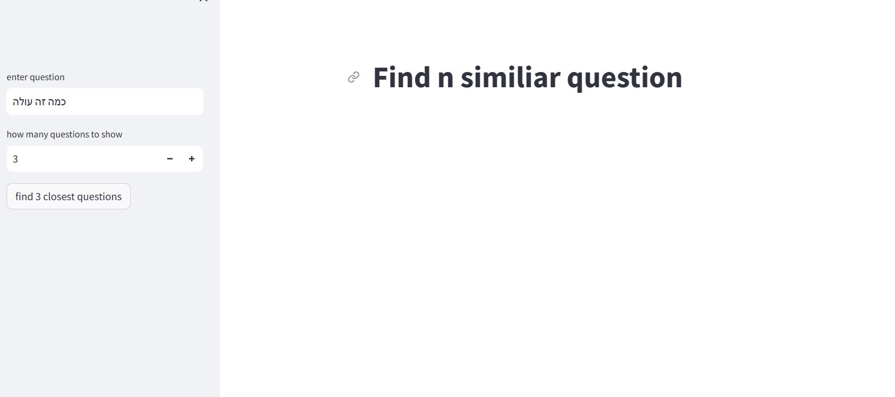
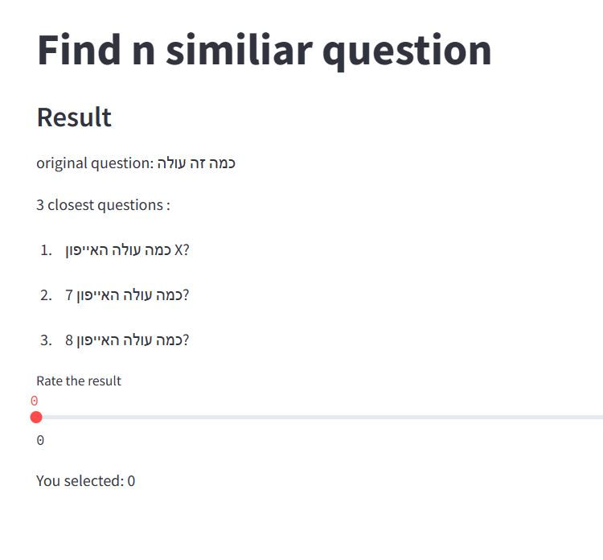
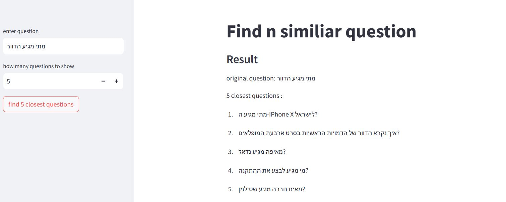

#

## 1. baseline find similar questions - app.py

streamlit app simple baseline 

main:

result:

other result:

## 2. finetuned find similar question

## 3. generate question based on input

finetune hebrew model on questions to generat questions based on user input.

the user writes few words and we try to generate the question he wants
to write 

